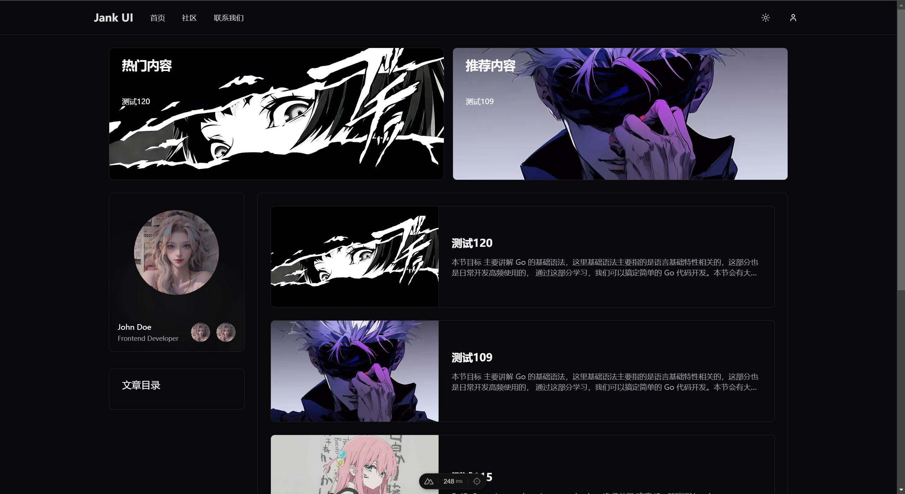
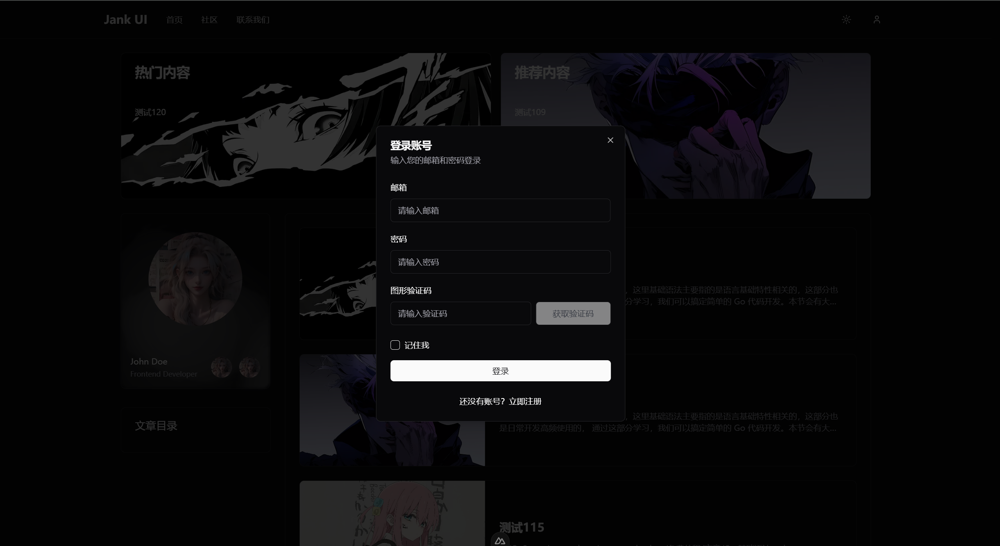

# Jank UI Nuxt

> 这是一个因个人原因暂被废弃的 `Nuxt + Vue3 + shadcn-vue` 的 博客系统项目，仅供交流学习。 
> 该项目灵感源于 [halo](https://www.halo.run/) 博客系统以及 [shadcn-vue](https://www.shadcn-vue.com/)。  
> 合作可联系作者 `Fender`, QQ: 927171598




```bash
npm install

npm run dev
```

> 后端采用 Golang 的 Echo框架，旨在考虑可拓展性和高性能。  
> 后端项目地址(暂未开源): [-->点击跳转<--](https://github.com/Done-0/jank_blog)